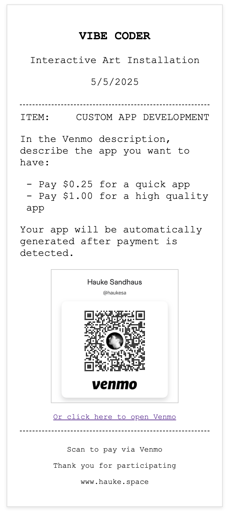
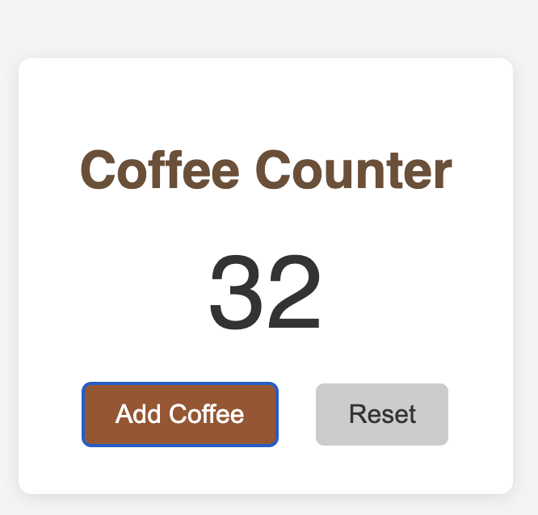

# App Design as a Commodity

## An Interactive Art Installation by [Hauke Sandhaus](https://haukesand.github.io/)

## Artist Statement

*App Design as a Commodity* invites you into a liminal space between creation and transaction, where the boundary between human artistry and algorithmic determinism dissolves into a receipt. In our world of accelerating abstraction, software—once a craft of painstaking expertise—transforms before our eyes into a consumable good, reduced to its simplest economic representation: a price point.

When you Venmo a modest sum to acquire a custom application, what exactly are you purchasing? The code itself? The creative labor? Or merely the permission to participate in an economic ritual that mimics the traditional exchange of value? As your personal app materializes through layers of abstraction—from language model to code repository to QR code to screen—it carries with it questions about our relationship with digital artifacts and the increasingly invisible infrastructure that produces them.

The thermal printer's gentle hum punctuates this meditation, generating a tangible artifact documenting the intangible. Each receipt becomes a physical record of ephemeral processes, bearing witness to the paradox of custom mass production in the age of generative AI.

## System Description

This installation consists of:

1. **Transaction Interface**: A Venmo QR code inviting participants to commission a custom app with a simple description and small payment ($0.25 for a quick app, $1.00 for a higher quality app)

2. **Computational Genesis**: At the moment of transaction confirmation, a dual-tiered artificial intelligence system—Gemini 1.5 Pro for modest contributions ($0.25) and the superior Gemini 2.5 Pro architecture for premium engagements ($1.00)—transmutes verbal description into executable digital artifact, orchestrating an autonomous deployment sequence that manifests the participant's vision within the GitHub repository ecosystem and instantiates it within the broader digital commons of the web

3. **Receipt Generation**: The system produces a receipt-like interface displaying:
   - The transaction details
   - Links to the generated application
   - QR code for immediate access
   - System logs revealing the algorithmic creation process

## Artist Statement

*App Design as a Commodity* invites you into a liminal space between creation and transaction, where the boundary between human artistry and algorithmic determinism dissolves into a receipt. In our world of accelerating abstraction, software—once a craft of painstaking expertise—transforms before our eyes into a consumable good, reduced to its simplest economic representation: a price point.

When you Venmo a modest sum to acquire a custom application, what exactly are you purchasing? The code itself? The creative labor? Or merely the permission to participate in an economic ritual that mimics the traditional exchange of value? As your personal app materializes through layers of abstraction—from language model to code repository to QR code to screen—it carries with it questions about our relationship with digital artifacts and the increasingly invisible infrastructure that produces them.

The thermal printer's gentle hum punctuates this meditation, generating a tangible artifact documenting the intangible. Each receipt becomes a physical record of ephemeral processes, bearing witness to the paradox of custom mass production in the age of generative AI.

## Interaction Flow

1. Participant scans the Venmo QR code and sends payment with an app description
2. System detects the payment via email monitoring
3. AI generates custom web app based on description and payment amount
4. Code is automatically deployed to [GitHub](https://github.com/sandvibe?tab=repositories)
5. Receipt with QR code and links is produced for the participant
6. Participant can access their custom app immediately via the generated link

## Technical Implementation

The installation employs:
- Python Flask backend with real-time email monitoring
- Gemini 1.5 Pro for code generation
- GitHub API integration for repository creation
- Thermal-printer style UI for receipts
- QR code generation for app access

## Reflections on Digital Value

What is the worth of code when it can be generated in seconds? How does the economy of automated creation impact our perception of digital goods? The receipt—showing both the price paid and the process of creation—becomes a mirror reflecting our own values projected onto digital artifacts.

In the era of mass AI-generated content, this installation offers no definitive answer, only a momentary pause to contemplate the shifting landscape of creation, consumption, and commodification.

---

*Project by [Hauke Sandhaus](https://haukesand.github.io/)*  
*All generated apps available at [github.com/sandvibe](https://github.com/sandvibe?tab=repositories)*